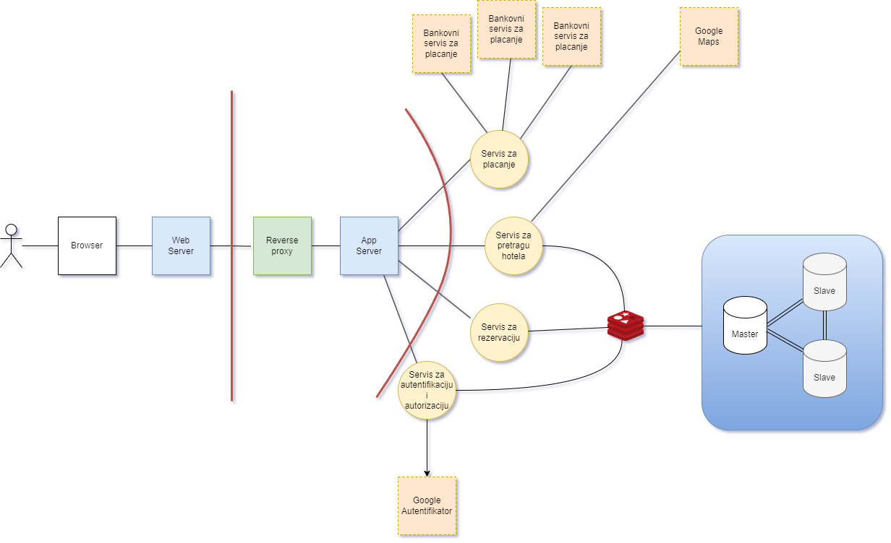

# C. POVRŠINA NAPADA (ATTACK SURFACE)

Ispitujući koji korisnici imaju interakciju sa sistemom, moguće je identifikovati ulazne tačke u sistem i odatle površinu napada.

Ispitajte koji korisnici (ljudski, eksterni sistemi) komuniciraju sa MegaTravel sistemom i odatle mapirajte površinu napada kao skup ulaznih tačaka sa kojih napadači mogu da sprovedu svoje napade.

---

Посматрамо архитектуру MegaTravel система:

Наранџасти правоугаоници представљају екстерне системе:

- Гуглов сервис за аутентификацију
- Гугл мапе
- Екстерни банковни сервиси за плаћање

Корисници могу бити:

- гости (корисник без налога)
- обични корисници
- администратори

Директан приступ серверу имају само програмери и друга запослена лица која су део развојног тима.

Директан приступ апликацији има свака особа, и површину напада мапирамо по апликацији.

- API
  - пријава и регистрација
  - претрага путовања
  - измена података о налогу
  - резервација и преглед резервисаних путовања
  - обављање уплате
  - измена платних података
- Фајлови
  - фотографије путовања
  - кориснички аватари
  - иконице
- Логистика
  - подаци о особљу
  - инфраструктура

Физичке површине напада се не разматрају под претпоставком да унутар компаније немамо малициозне актере и да је опрема довољно добро заштићена (и довољно дистрибуирана да ниједан од CIA не може бити компромитован нападом на један уређај). 
Ипак, неке од њих су наведене:
- извађени хард дискови
- USB и други периферни портови
- приступ сервер рачунарима
- лозинке и други приватни подаци писани на папирићима

https://www.infosecinstitute.com/resources/penetration-testing/discovering-entry-points/#:~:text=An%20entry%20point%20where%20from,weak%20points%20could%20be%20identified.

https://guptadeepak.com/cyber-attack-the-anatomy-of-an-average-hack-and-the-most-common-entry-points/

https://www.okta.com/identity-101/what-is-an-attack-surface/

https://informer.io/resources/why-financial-services-need-attack-surface-management

https://informer.io/resources/why-attack-surface-discovery-tools-matter