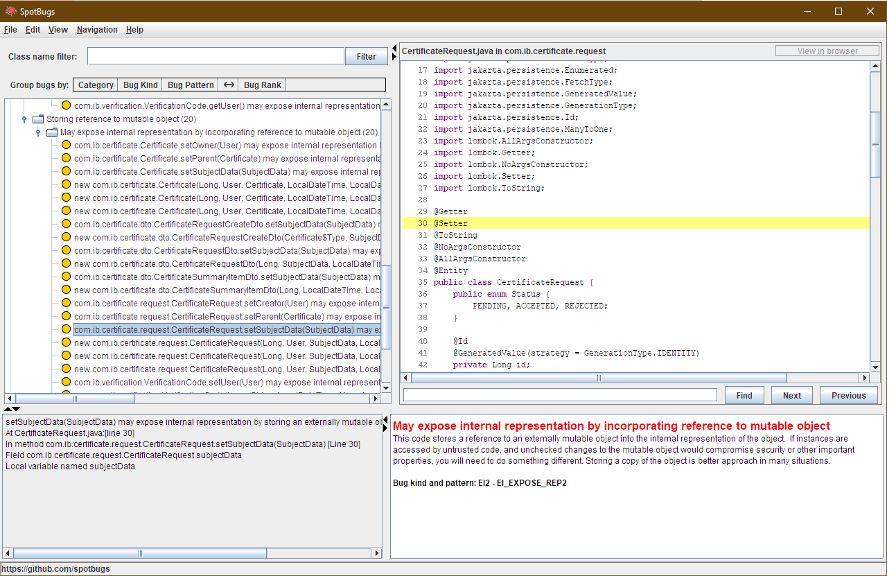

# Пронађени дефекти и препоруке за побољшање

Пројекат: sssscs (видети sssscs.md)

## (1) Употреба Random у Јави

Фајл: `VerificationCodeService.java`

```java
private VerificationCode generateCode(User user, Reason reason) {
    Random rnd = new Random();
    String codeStr = String.format("%06d", rnd.nextInt(999999));

    VerificationCode code = new VerificationCode(null, codeStr, LocalDateTime.now().plusSeconds(30), user, MAX_ATTEMPTS, reason);
    return repo.save(code);
}
```

Креирање `Random` објекта за једнократну употребу је лоша пракса јер је случанојст при генерисању бројева нарушена. Нове вредности се "лако" могу погодити. 

Решење: Чувати инстанцу `Random` класе на нивоу сервиса (тј. креирати га само једном). Користити `SecureRandom`.

## (2) Цурење лозинке за базу података

Фајл: `application.properties`

```properties
spring.datasource.driverClassName=org.h2.Driver
spring.datasource.username=admin
spring.datasource.password=IbSecure2468
spring.jpa.database-platform=org.hibernate.dialect.H2Dialect
```

Лозинка за конекцију ка бази података је изложена у plain text-у.

Решење: Користити екстернализоване алате попут Кубернетеса. Ту означити тајне environment варијабле, а онда у application.properties:

```
spring.datasource.password=${SPRING_DATASOURCE_PASSWORD}
```

## (3) Lombok

Lombok генерише shallow copy гетере и сетере, што у неким  случајевима није пожељно. Случајна модификација интерно мутабилних објеката у екстремним случајевима може произвести рањивост.

Решење: Употреба `@Setter(AccessLevel.NONE)` испред одговарајућег поља. Некоришћење Lombok-а.

## (4) HTTP access control

Фајл: `ServerConfig.java`

```java
@Bean
public SecurityFilterChain filterChain(HttpSecurity http) throws Exception {
    http.cors().and().csrf().disable();
    http.headers().frameOptions().disable();
    http.authorizeHttpRequests()
            .requestMatchers("/**").permitAll()
            .requestMatchers("/api/user/session/**").permitAll()
            .requestMatchers("/api/verification-code/**").permitAll()
            .anyRequest().authenticated();
    http.sessionManagement().sessionCreationPolicy(SessionCreationPolicy.STATELESS);
    http.addFilterBefore(jwtRequestFilter, UsernamePasswordAuthenticationFilter.class);
    http.exceptionHandling().authenticationEntryPoint(new HttpStatusEntryPoint(HttpStatus.UNAUTHORIZED));
    return http.build();
}
```

`.requestMatchers("/**").permitAll()` је уведен због потешкоћа приступу Swagger документацији током израде апликације. Међутим, овим је отворен приступ свим URL-овима што потенцијално може да се злоупотреби.

Решење: Избацити `.requestMatchers("/**").permitAll()`.

## (5) JWT

Фајл: `JwtTokenUtil.java`

```java
private static final SecretKey secret = MacProvider.generateKey(SignatureAlgorithm.HS256);
private static final byte[] secretBytes = secret.getEncoded();
private static final String base64SecretBytes = Base64.getEncoder().encodeToString(secretBytes);
```

Чување base64SecretBytes као String дуготрајно се не препоручује (из истог разлога као чување лозинки генерално у String објекту). 

Поред овога, генерисање новог кључа за JWT при сваком покретању сервера се не препоручује јер ће у случају репликације/скалирања изазвати нежељено понашање.

Решење: `secretBytes` конвертовати у B64 по потреби. Чувати фиксну JWT тајну у екстерној конфигурацији.

# Статистика

**Проведено време на анализи**: 3h15min

**Број дефеката**: 5 (пронађени су и други дефекти употребом алата за статичку анализу, али они су мање озбиљности те нису описани овде).

**Коришћени алати**:

- [SpotBugs](https://github.com/spotbugs/spotbugs)



