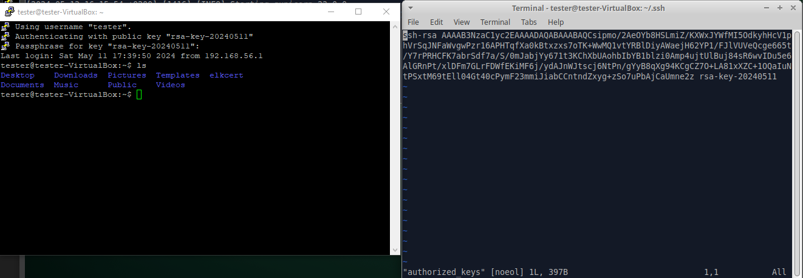

# Uvod

Napravljen je minimalni _Python_ _Flask_ server sa _SQLAlchemy_ bindingom, deployovan pomoću _gunicorn_ WSGI servera sa _nginx_ _reverse proxy_.

Server je deployovan na virtualnoj mašini sa Xubuntu 24.04 LTS operativnim sistemom. Pokušan je i Ubuntu 24.04 LTS Server koji dolazi bez grafičkog okruženja i minimalno instaliranih paketa, ali je bilo problema prilikom povezivanja mreže sa host računarom.

Lozinka naloga je podešena na `starcraftrules`

# Host <-> Guest

Za povezivanje host računara sa mrežom virtualne mašine bilo je potrebno uključiti dodatni _Host-Only Adapter_ u podešavanjima.


Na slici ispod je pokrenut server na virtualnoj mašini preko _gunicorn_ na portu 5000, sa podešenim _nginx_ koji prosleđuje zahteve sa defaultnog porta 80 na isti. _PowerShell_ konzola je na _host_ mašini i preko adrese 192.168.56.101 komunicira sa _guest_ mrežom.


# SSH

Na _guest_ mašini je instaliran `openssh-server` paket, dok je na _host_ _Windows_ mašini instaliran _PuTTY_. Pomoću _PuTTYgen_ je napravljen par RSA ključeva zaštićeni šifrom `123`. Javni ključ ostaje na _host_ mašini, dok privatni upisujemo u guestu na `~/.ssh/authorized_keys`.



# System review

## Operating system

```shell
tester@tester-VirtualBox:~$ lsb_release -a
Distributor ID:	Ubuntu
Description:	Ubuntu 24.04 LTS
Release:	24.04
Codename:	noble
```

LTS verzija je podržana do [Aprila 2029](https://ubuntu.com/about/release-cycle).

## Kernel

```shell
tester@tester-VirtualBox:~$ uname -a
Linux tester-VirtualBox 6.8.0-31-generic #31-Ubuntu SMP PREEMPT_DYNAMIC Sat Apr 20 00:40:06 UTC 2024 x86_64 x86_64 x86_64 GNU/Linux
```

Od trenutka pisanja (12.05.2024) ovo je najnovija _major_ verzija kernela.
TODO vulnerabillity, [sajt](https://ubuntu.com/security/cves) baca 500

## Time Management

```shell
tester@tester-VirtualBox:~$ cat /etc/timezone
Europe/Belgrade
```

Korišćena vremenska zona koristi _daylight savings_, što može biti problem za sinhronizaciju logova. Umesto toga mogli bi koristiti  `Etc/UTC`.

Takođe je preporučjivo koristiti NTP server. sa `ps -edf | grep ntp` vidimo da nije podrazumevano instaliran. Njega instaliramo sa `sudo apt get install` i onda vidimo:

```shell
tester@tester-VirtualBox:~$ ps -edf | grep ntp
ntpsec      2690       1  0 17:07 ?        00:00:00 /usr/sbin/ntpd -p /run/ntpd.pid -c /etc/ntpsec/ntp.conf -g -N -u ntpsec:ntpsec
tester      2759    2057  0 17:08 pts/1    00:00:00 grep --color=auto ntp

tester@tester-VirtualBox:~$ ntpq -p -n
     remote           refid      st t when poll reach   delay   offset   jitter
===============================================================================
 0.ubuntu.pool.n .POOL.          16 p    -  256    0   0.0000   0.0000   0.0001
 1.ubuntu.pool.n .POOL.          16 p    -  256    0   0.0000   0.0000   0.0001
 2.ubuntu.pool.n .POOL.          16 p    -  256    0   0.0000   0.0000   0.0001
 3.ubuntu.pool.n .POOL.          16 p    -  256    0   0.0000   0.0000   0.0001
 185.125.190.58  79.243.60.50     2 u   17   64    3 179.4054  45.2671  46.6586
+195.178.58.245  192.168.106.2    2 u   19   64    3 126.2326  47.8214  31.4819
+147.91.8.1      91.187.128.199   2 u   17   64    3 180.8268  51.2034  34.8132
+217.24.20.5     45.138.55.62     2 u   19   64    3 141.5327  56.6692  40.5344
*195.178.51.145  131.188.3.220    2 u   17   64    3 140.5314  54.8659  39.6509
+147.91.26.20    147.91.8.1       3 u   17   64    3 185.2244  57.2340  39.0078
 2001:470:74b9:: .INIT.          16 u    -   64    0   0.0000   0.0000   0.0001

```

## Packages installed

Možemo prebrojati broj paketa na sledeći način:

```shell
tester@tester-VirtualBox:~$ dpkg --list | wc --lines
1290
```

Poređenja radi, ista komanda je pokrenuta na Ubuntu 24.04 Server virtualnoj mašini, gde je dobijeno 742 paketa.

Preporuka je imati što manje instaliranih paketa (manji _attack surface_) i redovno ažurirati pakete (`sudo apt update`).

## Logging

Koristimo `rsyslog`:

```shell
tester@tester-VirtualBox:~$ ps -edf | grep syslog
message+     523       1  0 16:12 ?        00:00:03 @dbus-daemon --system --address=systemd: --nofork --nopidfile --systemd-activation --syslog-only
syslog       637       1  0 16:12 ?        00:00:00 /usr/sbin/rsyslogd -n -iNONE
tester      1036    1014  0 16:13 ?        00:00:03 /usr/bin/dbus-daemon --session --address=systemd: --nofork --nopidfile --systemd-activation --syslog-only
tester      2847    2057  0 17:18 pts/1    00:00:00 grep --color=auto syslog
```

# Network review

## General information

Ovde nam je zanimljivo kako je mašina povezana sa _host_ mašinom:

```shell
tester@tester-VirtualBox:~$ ifconfig -a | grep inet
        inet 10.0.2.15  netmask 255.255.255.0  broadcast 10.0.2.255
        inet6 fe80::a00:27ff:fe3e:c3ce  prefixlen 64  scopeid 0x20<link>
        inet 192.168.56.101  netmask 255.255.255.0  broadcast 192.168.56.255
        inet6 fe80::422d:9c9f:60be:b5a5  prefixlen 64  scopeid 0x20<link>
        inet 127.0.0.1  netmask 255.0.0.0
        inet6 ::1  prefixlen 128  scopeid 0x10<host>
```

Primećujemo `192.168.56.101`, što je u istoj podmreži kao `192.168.56.1` na _host_ mašini.

## Firewall rules

```shell
tester@tester-VirtualBox:~$ sudo iptables -L -v
Chain INPUT (policy ACCEPT 0 packets, 0 bytes)
 pkts bytes target     prot opt in     out     source               destination         

Chain FORWARD (policy ACCEPT 0 packets, 0 bytes)
 pkts bytes target     prot opt in     out     source               destination         

Chain OUTPUT (policy ACCEPT 0 packets, 0 bytes)
 pkts bytes target     prot opt in     out     source               destination         
```

Čini se da nisu podešena pravila?

## IPv6

Isto vidimo i za IPv6 pravila:

```shell
tester@tester-VirtualBox:~$ sudo ip6tables -L -v
Chain INPUT (policy ACCEPT 0 packets, 0 bytes)
 pkts bytes target     prot opt in     out     source               destination         

Chain FORWARD (policy ACCEPT 0 packets, 0 bytes)
 pkts bytes target     prot opt in     out     source               destination         

Chain OUTPUT (policy ACCEPT 0 packets, 0 bytes)
 pkts bytes target     prot opt in     out     source               destination         
```

Ako ne koristimo IPv6 preporučjivo je isključiti ga, što prema [ovom artiklu](https://itsfoss.com/disable-ipv6-ubuntu-linux/) možemo uraditi tako što u `/etc/sysctl.conf` dodamo sledeće:
```
net.ipv6.conf.all.disable_ipv6=1
net.ipv6.conf.default.disable_ipv6=1
net.ipv6.conf.lo.disable_ipv6=1
```

I zatim pokrenemo `sudo sysctl -p`. Ovim će IPv6 biti isključen čak i nakon restarta sistema.

# Filesystem review

## Mounted partitions

```shell
tester@tester-VirtualBox:~$ cat /etc/fstab
# /etc/fstab: static file system information.
#
# Use 'blkid' to print the universally unique identifier for a
# device; this may be used with UUID= as a more robust way to name devices
# that works even if disks are added and removed. See fstab(5).
#
# <file system> <mount point>   <type>  <options>       <dump>  <pass>
# / was on /dev/sda2 during curtin installation
/dev/disk/by-uuid/857a7abd-dc12-4653-af49-b8a258769509 / ext4 defaults 0 1
/swap.img	none	swap	sw	0	0
```

Od particija imamo sam `/dev` i `/swap`. Vidimo da `noatime` nije korišćen, međutim nisu ni `noexec` i `nosuid`.

## Sensitive files

```shell
tester@tester-VirtualBox:~$ cat /etc/shadow
cat: /etc/shadow: Permission denied
```

Vidimo da `shadow` fajl nije dostupan običnim korisnicima. Međutim, _sqlite database_ fajl jeste dostupan.

## setuid

```shell
tester@tester-VirtualBox:~$ find / -perm -4000 -ls
  1193277    412 -rwsr-xr--   1 root     dip        420416 Apr  3 19:56 /usr/sbin/pppd
  1192962     16 -rwsr-sr-x   1 root     root        14488 Apr 12 11:10 /usr/lib/xorg/Xorg.wrap
  1181766     20 -rwsr-xr-x   1 root     root        18736 Apr  3 20:26 /usr/lib/polkit-1/polkit-agent-helper-1
  1188288    148 -rwsr-xr-x   1 root     root       150728 Mar 31 19:14 /usr/lib/snapd/snap-confine
  1181723    336 -rwsr-xr-x   1 root     root       342632 Apr  5 21:30 /usr/lib/openssh/ssh-keysign
  1181583     36 -rwsr-xr--   1 root     messagebus    34960 Apr  8 16:38 /usr/lib/dbus-1.0/dbus-daemon-launch-helper
  1180144     72 -rwsr-xr-x   1 root     root          72792 Apr  9 09:01 /usr/bin/chfn
  1180863     56 -rwsr-xr-x   1 root     root          55680 Apr  9 16:02 /usr/bin/su
  1180663     32 -rwsr-xr-x   1 root     root          30952 Apr  3 20:26 /usr/bin/pkexec
  1180551     52 -rwsr-xr-x   1 root     root          51584 Apr  9 16:02 /usr/bin/mount
  1180327     76 -rwsr-xr-x   1 root     root          76248 Apr  9 09:01 /usr/bin/gpasswd
  1180864    272 -rwsr-xr-x   1 root     root         277936 Apr  8 16:50 /usr/bin/sudo
  1180304     40 -rwsr-xr-x   1 root     root          39296 Apr  8 17:57 /usr/bin/fusermount3
  1180952     40 -rwsr-xr-x   1 root     root          39296 Apr  9 16:02 /usr/bin/umount
  1180567     40 -rwsr-xr-x   1 root     root          40664 Apr  9 09:01 /usr/bin/newgrp
  1180150     44 -rwsr-xr-x   1 root     root          44760 Apr  9 09:01 /usr/bin/chsh
  1180621     64 -rwsr-xr-x   1 root     root          64152 Apr  9 09:01 /usr/bin/passwd
```

setuid omogućava da se fajl izvrši sa privilegijama svog vlasnika, što može biti opasno ako je vlasnik root. Iz liste iznad izgleda da nema sumnjivih setuid fajlova.

## Normal files

Svi _readable_ i _writable_:
```shell
tester@tester-VirtualBox:~$ find / -type f -perm -006 2>/dev/null
/sys/kernel/security/apparmor/.remove
/sys/kernel/security/apparmor/.replace
/sys/kernel/security/apparmor/.load
/sys/kernel/security/apparmor/.notify
/sys/kernel/security/apparmor/.access
/mnt/a.txt
/mnt/analysis.md
/mnt/app.py
/mnt/nginx.conf
/mnt/public
/mnt/requirements.txt
/mnt/res/adapter.png
/mnt/res/host_guest.png
/mnt/res/ssh.png
/mnt/wsgi.py
```

Svi _writable_:
```shell
tester@tester-VirtualBox:~$ find / -type f -perm -002 2>/dev/null
/sys/kernel/security/apparmor/.remove
/sys/kernel/security/apparmor/.replace
/sys/kernel/security/apparmor/.load
/sys/kernel/security/apparmor/.notify
/sys/kernel/security/apparmor/.access
/mnt/a.txt
/mnt/analysis.md
/mnt/app.py
/mnt/nginx.conf
/mnt/public
/mnt/requirements.txt
/mnt/res/adapter.png
/mnt/res/host_guest.png
/mnt/res/ssh.png
/mnt/wsgi.py
```

Isključivši `/mnt` koji smo koristili za prebacivanje fajlova servera sa _host_ na _guest_ računar, izlgeda da svi korisnici imaju _read_ i _write_ pristup samo određenim fajlovima u `/apparmor` direktorijumu

## Backup

Sistem ne dolazi sa bilo kakvim _backup_-om, međutim ako bi omogućili _backup_ moramo paziti na permisije sačuvanih fajlova, ne bi li napadaču slučajno nešto izložili.

# Users review

## Reviewing the passwd file

```shell
tester@tester-VirtualBox:~$ cat /etc/passwd
root:x:0:0:root:/root:/bin/bash
daemon:x:1:1:daemon:/usr/sbin:/usr/sbin/nologin
bin:x:2:2:bin:/bin:/usr/sbin/nologin
sys:x:3:3:sys:/dev:/usr/sbin/nologin
sync:x:4:65534:sync:/bin:/bin/sync
games:x:5:60:games:/usr/games:/usr/sbin/nologin
man:x:6:12:man:/var/cache/man:/usr/sbin/nologin
lp:x:7:7:lp:/var/spool/lpd:/usr/sbin/nologin
mail:x:8:8:mail:/var/mail:/usr/sbin/nologin
news:x:9:9:news:/var/spool/news:/usr/sbin/nologin
uucp:x:10:10:uucp:/var/spool/uucp:/usr/sbin/nologin
proxy:x:13:13:proxy:/bin:/usr/sbin/nologin
www-data:x:33:33:www-data:/var/www:/usr/sbin/nologin
backup:x:34:34:backup:/var/backups:/usr/sbin/nologin
list:x:38:38:Mailing List Manager:/var/list:/usr/sbin/nologin
irc:x:39:39:ircd:/run/ircd:/usr/sbin/nologin
_apt:x:42:65534::/nonexistent:/usr/sbin/nologin
nobody:x:65534:65534:nobody:/nonexistent:/usr/sbin/nologin
systemd-network:x:998:998:systemd Network Management:/:/usr/sbin/nologin
systemd-timesync:x:996:996:systemd Time Synchronization:/:/usr/sbin/nologin
dhcpcd:x:100:65534:DHCP Client Daemon,,,:/usr/lib/dhcpcd:/bin/false
messagebus:x:101:101::/nonexistent:/usr/sbin/nologin
syslog:x:102:102::/nonexistent:/usr/sbin/nologin
systemd-resolve:x:991:991:systemd Resolver:/:/usr/sbin/nologin
uuidd:x:103:103::/run/uuidd:/usr/sbin/nologin
usbmux:x:104:46:usbmux daemon,,,:/var/lib/usbmux:/usr/sbin/nologin
tss:x:105:104:TPM software stack,,,:/var/lib/tpm:/bin/false
kernoops:x:106:65534:Kernel Oops Tracking Daemon,,,:/:/usr/sbin/nologin
dnsmasq:x:999:65534:dnsmasq:/var/lib/misc:/usr/sbin/nologin
avahi:x:107:110:Avahi mDNS daemon,,,:/run/avahi-daemon:/usr/sbin/nologin
lightdm:x:108:111:Light Display Manager:/var/lib/lightdm:/bin/false
tcpdump:x:109:113::/nonexistent:/usr/sbin/nologin
fwupd-refresh:x:990:990:Firmware update daemon:/var/lib/fwupd:/usr/sbin/nologin
saned:x:110:116::/var/lib/saned:/usr/sbin/nologin
pulse:x:111:117:PulseAudio daemon,,,:/run/pulse:/usr/sbin/nologin
cups-browsed:x:112:114::/nonexistent:/usr/sbin/nologin
hplip:x:113:7:HPLIP system user,,,:/run/hplip:/bin/false
polkitd:x:989:989:User for polkitd:/:/usr/sbin/nologin
rtkit:x:114:120:RealtimeKit,,,:/proc:/usr/sbin/nologin
colord:x:115:121:colord colour management daemon,,,:/var/lib/colord:/usr/sbin/nologin
tester:x:1000:1000:tester:/home/tester:/bin/bash
sshd:x:116:65534::/run/sshd:/usr/sbin/nologin
ntpsec:x:117:123::/nonexistent:/usr/sbin/nologin
```

Samo root ima uid 0.

# Reviewing the shadow file

```shell
tester@tester-VirtualBox:~$ sudo cat /etc/shadow
root:*:19837:0:99999:7:::
daemon:*:19837:0:99999:7:::
bin:*:19837:0:99999:7:::
sys:*:19837:0:99999:7:::
sync:*:19837:0:99999:7:::
games:*:19837:0:99999:7:::
man:*:19837:0:99999:7:::
lp:*:19837:0:99999:7:::
mail:*:19837:0:99999:7:::
news:*:19837:0:99999:7:::
uucp:*:19837:0:99999:7:::
proxy:*:19837:0:99999:7:::
www-data:*:19837:0:99999:7:::
backup:*:19837:0:99999:7:::
list:*:19837:0:99999:7:::
irc:*:19837:0:99999:7:::
_apt:*:19837:0:99999:7:::
nobody:*:19837:0:99999:7:::
systemd-network:!*:19837::::::
systemd-timesync:!*:19837::::::
dhcpcd:!:19837::::::
messagebus:!:19837::::::
syslog:!:19837::::::
systemd-resolve:!*:19837::::::
uuidd:!:19837::::::
usbmux:!:19837::::::
tss:!:19837::::::
kernoops:!:19837::::::
dnsmasq:!:19837::::::
avahi:!:19837::::::
lightdm:!:19837::::::
tcpdump:!:19837::::::
fwupd-refresh:!*:19837::::::
saned:!:19837::::::
pulse:!:19837::::::
cups-browsed:!:19837::::::
hplip:!:19837::::::
polkitd:!*:19837::::::
rtkit:!:19837::::::
colord:!:19837::::::
tester:$6$0Wc9jrtsEcBeUtVz$xfEL/evTyK1oRkwMZ0j/5mBxsDcegVpcQe1PPuQONai.jCGa7WwPVS4ei2DuYn2cpGRFHMjDjjngVZNmT8wH.0:19853:0:99999:7:::
sshd:!:19853::::::
ntpsec:!:19855::::::
```

Korisnički nalog koji smo kreirali `tester` ima lozinku koja počinje sa $6, što znači da je korišćen SHA-512 algoritam. Na ostalim nalozima nije moguć login, uključujući `root`.

```shell
tester@tester-VirtualBox:~$ cat /etc/pam.d/common-password
[...]
# here are the per-package modules (the "Primary" block)
password	[success=1 default=ignore]	pam_unix.so obscure yescrypt
# here's the fallback if no module succeeds
password	requisite			pam_deny.so
# prime the stack with a positive return value if there isn't one already;
# this avoids us returning an error just because nothing sets a success code
# since the modules above will each just jump around
password	required			pam_permit.so
# and here are more per-package modules (the "Additional" block)
password	optional	pam_gnome_keyring.so 
# end of pam-auth-update config
```

Vidimo da je podrazumevani algoritam `yescrypt`, koji je [otporniji](https://en.wikipedia.org/wiki/Yescrypt) na _offline password cracking_ od SHA-512.

```shell
tester@tester-VirtualBox:~$ sudo john /etc/shadow
Created directory: /root/.john
Loaded 1 password hash (crypt, generic crypt(3 [?/64))
Will run 4 OpenMP threads
Press 'q' or Ctrl-C to abort, almost any other key for status
0g 0:00:51:18 3/3 0g/s 1407p/s 1470c/s 1407C/s basmelel..basmunil
```

Nakon skoro sat vremena, šifra `starcraftrules` još nije krekovana...

## Reviewing the sudo configuration

```shell
tester@tester-VirtualBox:~$ cat /etc/sudoers
#
# This file MUST be edited with the 'visudo' command as root.
#
# Please consider adding local content in /etc/sudoers.d/ instead of
# directly modifying this file.
#
# See the man page for details on how to write a sudoers file.
#
Defaults	env_reset
Defaults	mail_badpass
Defaults	secure_path="/usr/local/sbin:/usr/local/bin:/usr/sbin:/usr/bin:/sbin:/bin:/snap/bin"

# This fixes CVE-2005-4890 and possibly breaks some versions of kdesu
# (#1011624, https://bugs.kde.org/show_bug.cgi?id=452532)
Defaults	use_pty

[...]

# User privilege specification
root	ALL=(ALL:ALL) ALL

# Members of the admin group may gain root privileges
%admin ALL=(ALL) ALL

# Allow members of group sudo to execute any command
%sudo	ALL=(ALL:ALL) ALL

# See sudoers(5) for more information on "@include" directives:

@includedir /etc/sudoers.d
```

Naš `test` korisnik nije naveden u fajlu, on privilegovani pristup dobija isključivo jednokratnom upotrebom `sudo` komande.

# Services review

## Identifying running services

```shell
tester@tester-VirtualBox:~$ ps -edf
UID          PID    PPID  C STIME TTY          TIME CMD
root           1       0  0 16:12 ?        00:00:06 /sbin/init splash
root           2       0  0 16:12 ?        00:00:00 [kthreadd]
root           3       2  0 16:12 ?        00:00:00 [pool_workqueue_release]
root           4       2  0 16:12 ?        00:00:00 [kworker/R-rcu_g]
root           5       2  0 16:12 ?        00:00:00 [kworker/R-rcu_p]
root           6       2  0 16:12 ?        00:00:00 [kworker/R-slub_]
root           7       2  0 16:12 ?        00:00:00 [kworker/R-netns]
root          11       2  0 16:12 ?        00:00:00 [kworker/u8:0-ext4-rsv-conversion]
root          12       2  0 16:12 ?        00:00:00 [kworker/R-mm_pe]
root          13       2  0 16:12 ?        00:00:00 [rcu_tasks_kthread]
root          14       2  0 16:12 ?        00:00:00 [rcu_tasks_rude_kthread]
root          15       2  0 16:12 ?        00:00:00 [rcu_tasks_trace_kthread]
root          16       2  0 16:12 ?        00:00:01 [ksoftirqd/0]
root          17       2  0 16:12 ?        00:00:01 [rcu_preempt]
root          18       2  0 16:12 ?        00:00:00 [migration/0]
root          19       2  0 16:12 ?        00:00:00 [idle_inject/0]
root          20       2  0 16:12 ?        00:00:00 [cpuhp/0]
root          21       2  0 16:12 ?        00:00:00 [cpuhp/1]
root          22       2  0 16:12 ?        00:00:00 [idle_inject/1]
root          23       2  0 16:12 ?        00:00:00 [migration/1]
root          24       2  0 16:12 ?        00:00:00 [ksoftirqd/1]
root          27       2  0 16:12 ?        00:00:00 [cpuhp/2]
root          28       2  0 16:12 ?        00:00:00 [idle_inject/2]
root          29       2  0 16:12 ?        00:00:01 [migration/2]
root          30       2  0 16:12 ?        00:00:00 [ksoftirqd/2]
root          33       2  0 16:12 ?        00:00:00 [cpuhp/3]
root          34       2  0 16:12 ?        00:00:00 [idle_inject/3]
root          35       2  0 16:12 ?        00:00:01 [migration/3]
root          36       2  0 16:12 ?        00:00:00 [ksoftirqd/3]
root          43       2  0 16:12 ?        00:00:00 [kdevtmpfs]
root          44       2  0 16:12 ?        00:00:00 [kworker/R-inet_]
root          46       2  0 16:12 ?        00:00:00 [kauditd]
root          47       2  0 16:12 ?        00:00:00 [khungtaskd]
root          48       2  0 16:12 ?        00:00:00 [oom_reaper]
root          50       2  0 16:12 ?        00:00:00 [kworker/R-write]
root          51       2  0 16:12 ?        00:00:00 [kcompactd0]
root          52       2  0 16:12 ?        00:00:00 [ksmd]
root          54       2  0 16:12 ?        00:00:00 [khugepaged]
root          55       2  0 16:12 ?        00:00:00 [kworker/R-kinte]
root          56       2  0 16:12 ?        00:00:00 [kworker/R-kbloc]
root          57       2  0 16:12 ?        00:00:00 [kworker/R-blkcg]
root          58       2  0 16:12 ?        00:00:00 [irq/9-acpi]
root          60       2  0 16:12 ?        00:00:00 [kworker/R-tpm_d]
root          61       2  0 16:12 ?        00:00:00 [kworker/R-ata_s]
root          62       2  0 16:12 ?        00:00:00 [kworker/R-md]
root          63       2  0 16:12 ?        00:00:00 [kworker/R-md_bi]
root          64       2  0 16:12 ?        00:00:00 [kworker/R-edac-]
root          65       2  0 16:12 ?        00:00:00 [kworker/R-devfr]
root          66       2  0 16:12 ?        00:00:00 [watchdogd]
root          69       2  0 16:12 ?        00:00:00 [kswapd0]
root          70       2  0 16:12 ?        00:00:00 [ecryptfs-kthread]
root          71       2  0 16:12 ?        00:00:00 [kworker/R-kthro]
root          72       2  0 16:12 ?        00:00:00 [kworker/R-acpi_]
root          73       2  0 16:12 ?        00:00:00 [scsi_eh_0]
root          74       2  0 16:12 ?        00:00:00 [kworker/R-scsi_]
root          75       2  0 16:12 ?        00:00:00 [scsi_eh_1]
root          76       2  0 16:12 ?        00:00:00 [kworker/R-scsi_]
root          81       2  0 16:12 ?        00:00:00 [kworker/R-mld]
root          82       2  0 16:12 ?        00:00:00 [kworker/R-ipv6_]
root          93       2  0 16:12 ?        00:00:00 [kworker/R-kstrp]
root          95       2  0 16:12 ?        00:00:00 [kworker/u13:0]
root          96       2  0 16:12 ?        00:00:00 [kworker/u14:0]
root          97       2  0 16:12 ?        00:00:00 [kworker/u15:0]
root          98       2  0 16:12 ?        00:00:00 [kworker/u16:0]
root          99       2  0 16:12 ?        00:00:00 [kworker/u17:0]
root         112       2  0 16:12 ?        00:00:00 [kworker/R-charg]
root         169       2  0 16:12 ?        00:00:00 [scsi_eh_2]
root         170       2  0 16:12 ?        00:00:00 [kworker/R-scsi_]
root         171       2  0 16:12 ?        00:00:01 [kworker/u10:3-events_freezable_power_]
root         211       2  0 16:12 ?        00:00:01 [jbd2/sda2-8]
root         212       2  0 16:12 ?        00:00:00 [kworker/R-ext4-]
root         271       1  0 16:12 ?        00:00:02 /usr/lib/systemd/systemd-journald
root         315       2  0 16:12 ?        00:00:00 [kworker/u8:1-ext4-rsv-conversion]
root         335       1  0 16:12 ?        00:00:01 /usr/lib/systemd/systemd-udevd
systemd+     365       1  0 16:12 ?        00:00:00 /usr/lib/systemd/systemd-resolved
root         434       2  0 16:12 ?        00:00:00 [psimon]
root         514       1  0 16:12 ?        00:00:00 /usr/lib/systemd/systemd-logind
root         516       1  0 16:12 ?        00:00:01 /usr/libexec/accounts-daemon
avahi        519       1  0 16:12 ?        00:00:00 avahi-daemon: running [tester-VirtualBox.local]
root         520       1  0 16:12 ?        00:00:00 /usr/sbin/cron -f -P
message+     523       1  0 16:12 ?        00:00:03 @dbus-daemon --system --address=systemd: --nofork --nopidfile --systemd-activation --syslog-only
polkitd      563       1  0 16:12 ?        00:00:01 /usr/lib/polkit-1/polkitd --no-debug
root         583       1  0 16:12 ?        00:00:00 /usr/libexec/udisks2/udisksd
avahi        621     519  0 16:12 ?        00:00:00 avahi-daemon: chroot helper
syslog       637       1  0 16:12 ?        00:00:01 /usr/sbin/rsyslogd -n -iNONE
root         648       1  0 16:12 ?        00:00:02 /usr/sbin/NetworkManager --no-daemon
root         656       1  0 16:12 ?        00:00:00 /usr/sbin/wpa_supplicant -u -s -O DIR=/run/wpa_supplicant GROUP=netdev
root         681       1  0 16:12 ?        00:00:00 /usr/sbin/ModemManager
root         726       2  0 16:12 ?        00:00:00 [kworker/R-crypt]
root         730       2  0 16:12 ?        00:00:00 [irq/18-vmwgfx]
root         731       2  0 16:12 ?        00:00:00 [kworker/R-ttm]
root         916       1  0 16:12 ?        00:00:00 /usr/sbin/cupsd -l
root         918       1  0 16:12 ?        00:00:00 /usr/bin/python3 /usr/share/unattended-upgrades/unattended-upgrade-shutdown --wait-for-signal
root         928       1  0 16:12 ?        00:00:00 /usr/sbin/lightdm
lp           938     916  0 16:12 ?        00:00:00 /usr/lib/cups/notifier/dbus dbus://
cups-br+     947       1  0 16:12 ?        00:00:00 /usr/sbin/cups-browsed
kernoops     955       1  0 16:12 ?        00:00:00 /usr/sbin/kerneloops --test
kernoops     963       1  0 16:12 ?        00:00:00 /usr/sbin/kerneloops
root         972     928  1 16:12 tty7     00:01:38 /usr/lib/xorg/Xorg -core :0 -seat seat0 -auth /var/run/lightdm/root/:0 -nolisten tcp vt7 -novtswitch
root         980       1  0 16:12 ?        00:00:00 nginx: master process /usr/sbin/nginx -g daemon on; master_process on;
nobody       981     980  0 16:12 ?        00:00:00 nginx: worker process
root         987       1  0 16:12 tty1     00:00:00 /sbin/agetty -o -p -- \u --noclear - linux
root        1006     928  0 16:13 ?        00:00:00 lightdm --session-child 13 16
tester      1014       1  0 16:13 ?        00:00:00 /usr/lib/systemd/systemd --user
tester      1016    1014  0 16:13 ?        00:00:00 (sd-pam)
tester      1027    1014  0 16:13 ?        00:00:00 /usr/bin/pipewire
tester      1028    1014  0 16:13 ?        00:00:00 /usr/bin/pipewire -c filter-chain.conf
tester      1029    1014  0 16:13 ?        00:00:00 /usr/bin/wireplumber
tester      1030    1014  0 16:13 ?        00:00:00 /usr/bin/pipewire-pulse
tester      1031    1006  0 16:13 ?        00:00:01 xfce4-session
tester      1036    1014  0 16:13 ?        00:00:05 /usr/bin/dbus-daemon --session --address=systemd: --nofork --nopidfile --systemd-activation --syslog-only
rtkit       1045       1  0 16:13 ?        00:00:00 /usr/libexec/rtkit-daemon
tester      1131    1014  0 16:13 ?        00:00:00 /usr/libexec/at-spi-bus-launcher
tester      1138    1131  0 16:13 ?        00:00:00 /usr/bin/dbus-daemon --config-file=/usr/share/defaults/at-spi2/accessibility.conf --nofork --print-address 11 --address=unix:path=/run/user/1000/at-spi/bus_0
tester      1149    1014  0 16:13 ?        00:00:01 /usr/libexec/at-spi2-registryd --use-gnome-session
tester      1158    1014  0 16:13 ?        00:00:00 /usr/bin/gnome-keyring-daemon --foreground --components=pkcs11,secrets --control-directory=/run/user/1000/keyring
tester      1163    1031  0 16:13 ?        00:00:09 xfwm4 --replace
tester      1167    1014  0 16:13 ?        00:00:00 /usr/libexec/gvfsd
tester      1185    1031  0 16:13 ?        00:00:01 xfsettingsd
root        1190       1  0 16:13 ?        00:00:00 /usr/libexec/upowerd
tester      1197    1031  0 16:13 ?        00:00:02 xfce4-panel
tester      1202    1031  0 16:13 ?        00:00:00 Thunar --daemon
tester      1208    1031  0 16:13 ?        00:00:04 xfdesktop
tester      1209    1197  0 16:13 ?        00:00:01 /usr/lib/x86_64-linux-gnu/xfce4/panel/wrapper-2.0 /usr/lib/x86_64-linux-gnu/xfce4/panel/plugins/libwhiskermenu.so 1 14680071 whiskermenu Whisker Menu Show a menu to easily access installed applications
tester      1210    1197  0 16:13 ?        00:00:00 /usr/lib/x86_64-linux-gnu/xfce4/panel/wrapper-2.0 /usr/lib/x86_64-linux-gnu/xfce4/panel/plugins/libsystray.so 5 14680072 systray Status Tray Plugin Provides status notifier items (application indicators) and legacy systray items
tester      1211    1197  0 16:13 ?        00:00:00 /usr/lib/x86_64-linux-gnu/xfce4/panel/wrapper-2.0 /usr/lib/x86_64-linux-gnu/xfce4/panel/plugins/libnotification-plugin.so 6 14680073 notification-plugin Notification Plugin Notification plugin for the Xfce panel
tester      1212    1197  0 16:13 ?        00:00:00 /usr/lib/x86_64-linux-gnu/xfce4/panel/wrapper-2.0 /usr/lib/x86_64-linux-gnu/xfce4/panel/plugins/libindicator-plugin.so 7 14680074 indicator Indicator Plugin Provides a panel area for Unity indicators. Indicators allow applications and system services to display their status and interact with the user.
tester      1213    1197  0 16:13 ?        00:00:00 /usr/lib/x86_64-linux-gnu/xfce4/panel/wrapper-2.0 /usr/lib/x86_64-linux-gnu/xfce4/panel/plugins/libxfce4powermanager.so 8 14680075 power-manager-plugin Power Manager Plugin Display the battery levels of your devices and control the brightness of your display
tester      1214    1197  0 16:13 ?        00:00:00 /usr/lib/x86_64-linux-gnu/xfce4/panel/wrapper-2.0 /usr/lib/x86_64-linux-gnu/xfce4/panel/plugins/libpulseaudio-plugin.so 9 14680076 pulseaudio PulseAudio Plugin Adjust the audio volume of the PulseAudio sound system
tester      1244    1031  0 16:13 ?        00:00:00 /usr/libexec/polkit-mate-authentication-agent-1
tester      1251       1  0 16:13 ?        00:00:01 xcape -e Super_L Alt_L Pause
tester      1256    1031  0 16:13 ?        00:00:00 /usr/libexec/ayatana-indicator-application/ayatana-indicator-application-service
tester      1260    1031  0 16:13 ?        00:00:00 xiccd
tester      1268    1031  0 16:13 ?        00:00:00 xfce4-power-manager
tester      1270    1014  0 16:13 ?        00:00:00 /usr/lib/x86_64-linux-gnu/xfce4/notifyd/xfce4-notifyd
tester      1277    1031  0 16:13 ?        00:00:00 nm-applet
colord      1282       1  0 16:13 ?        00:00:00 /usr/libexec/colord
tester      1286    1031  0 16:13 ?        00:00:01 xfce4-screensaver
tester      1300    1014  0 16:13 ?        00:00:00 /usr/libexec/gvfs-udisks2-volume-monitor
tester      1337    1167  0 16:13 ?        00:00:00 /usr/libexec/gvfsd-trash --spawner :1.21 /org/gtk/gvfs/exec_spaw/0
tester      1398       1  0 16:13 ?        00:00:28 /usr/bin/xfce4-terminal
tester      1404    1398  0 16:13 pts/0    00:00:00 bash
tester      1416    1404  0 16:15 pts/0    00:00:01 /home/tester/elkcert/venv/bin/python3 /home/tester/elkcert/venv/bin/gunicorn --bind 0.0.0.0:5000 app:app
tester      1417    1416  0 16:15 pts/0    00:00:00 /home/tester/elkcert/venv/bin/python3 /home/tester/elkcert/venv/bin/gunicorn --bind 0.0.0.0:5000 app:app
tester      1524    1014  0 16:33 ?        00:00:04 /usr/lib/x86_64-linux-gnu/xfce4/xfconf/xfconfd
root        1535       1  0 16:33 ?        00:00:01 /usr/libexec/fwupd/fwupd
root        1616       1  0 16:37 ?        00:00:00 sshd: /usr/sbin/sshd -D [listener] 0 of 10-100 startups
tester      1964       1  0 16:43 ?        00:00:00 SCREEN
tester      1965    1964  0 16:43 pts/2    00:00:00 /bin/bash
tester      1988       1  0 16:44 ?        00:00:00 SCREEN
tester      1989    1988  0 16:44 pts/3    00:00:00 /bin/bash
tester      2057    1398  0 16:48 pts/1    00:00:00 bash
root        2675       2  0 17:07 ?        00:00:00 [psimon]
ntpsec      2690       1  0 17:07 ?        00:00:01 /usr/sbin/ntpd -p /run/ntpd.pid -c /etc/ntpsec/ntp.conf -g -N -u ntpsec:ntpsec
root        2693       2  0 17:07 ?        00:00:00 [kworker/1:1-ata_sff]
tester      2780    2057  0 17:10 pts/1    00:00:00 less
root        2798       2  0 17:13 ?        00:00:00 [kworker/1:0H-kblockd]
root        2800       2  0 17:14 ?        00:00:02 [kworker/3:2-ata_sff]
root        2850       2  0 17:19 ?        00:00:00 [kworker/u11:0-events_power_efficient]
root        2853       2  0 17:20 ?        00:00:00 [kworker/2:0-events]
root        2896       2  0 17:28 ?        00:00:00 [kworker/u9:2-events_unbound]
root        2897       2  0 17:28 ?        00:00:00 [kworker/2:1H-kblockd]
root        2900       2  0 17:28 ?        00:00:00 [kworker/0:0-mm_percpu_wq]
root        2971       2  0 17:45 ?        00:00:00 [kworker/u10:1-events_power_efficient]
root        2973       2  0 17:45 ?        00:00:00 [kworker/u12:1-writeback]
root        2974       2  0 17:45 ?        00:00:00 [kworker/u11:2-events_unbound]
root        2982       2  0 17:45 ?        00:00:00 [kworker/3:1H-kblockd]
root        2994       2  0 17:48 ?        00:00:00 [kworker/0:2-events]
root        3013       2  0 17:53 ?        00:00:00 [kworker/1:1H-kblockd]
root        3028       2  0 17:58 ?        00:00:00 [kworker/u10:0-events_unbound]
root        3033       2  0 17:58 ?        00:00:00 [kworker/u9:3-events_power_efficient]
root        3038       2  0 17:58 ?        00:00:03 [kworker/2:1-events]
root        3049       2  0 18:00 ?        00:00:00 [kworker/3:0H-kblockd]
root        3063       2  0 18:03 ?        00:00:00 [kworker/0:1H]
root        3067       2  0 18:05 ?        00:00:00 [kworker/u12:0-flush-8:0]
root        3068       2  0 18:05 ?        00:00:00 [kworker/2:0H-kblockd]
root        3143       2  0 18:08 ?        00:00:00 [kworker/1:2-cgroup_destroy]
root        3144       2  0 18:08 ?        00:00:00 [kworker/u9:0-events_power_efficient]
root        3212       2  0 18:08 ?        00:00:00 [kworker/0:0H-kblockd]
root        3215    2057  0 18:10 pts/1    00:00:00 sudo john /etc/shadow
root        3216    3215  0 18:10 pts/4    00:00:00 sudo john /etc/shadow
root        3217    3216 99 18:10 pts/4    00:32:32 john /etc/shadow
root        3221       2  0 18:10 ?        00:00:00 [kworker/u12:2-events_unbound]
root        3231       2  0 18:13 ?        00:00:01 [kworker/3:0-events]
root        3233       2  0 18:13 ?        00:00:00 [kworker/u11:1-events_power_efficient]
tester      3241    1398  0 18:13 pts/5    00:00:00 bash
root        3259       2  0 18:16 ?        00:00:00 [kworker/2:2-events]
root        3272       2  0 18:18 ?        00:00:00 [kworker/1:0-cgroup_destroy]
root        3273       2  0 18:18 ?        00:00:00 [kworker/0:2H]
root        3274       2  0 18:18 ?        00:00:00 [kworker/3:1-events]
tester      3276    3241 16 18:19 pts/5    00:00:00 ps -edf
```

```shell
tester@tester-VirtualBox:~$ lsof -i UDP -n -P
```

Komanda iznad vraća prazan rezultat. Nemamo nikakvu stalnu konekciju sa spoljnim svetom?

```shell
tester@tester-VirtualBox:~$ lsof -i TCP -n -P
COMMAND   PID   USER   FD   TYPE DEVICE SIZE/OFF NODE NAME
gunicorn 1416 tester    5u  IPv4  11613      0t0  TCP *:5000 (LISTEN)
gunicorn 1417 tester    5u  IPv4  11613      0t0  TCP *:5000 (LISTEN)
```

Imamo dva `gunicorn` procesa koji serviraju _Python_ veb server.

## OpenSSH

```shell
tester@tester-VirtualBox:~$ cat /etc/ssh/sshd_config
LogLevel DEBUG3
```

Jedino se spominje `LogLevel`, što sam ručno dodao prilikom nameštanja SSH. Preporučeno je uraditi sledeće:
- Kako se ne spominje `PermissionRootLogin` smatra se da je podrazumevana vrednost `yes`, te bi to trebalo promeniti na `no`
- Trebalo bi dodati liniju `protocol 2`, da naglasimo da se koristi protokol verzije 2.
- Promeniti port na nestandardni
- `AllowTCPForwarding` podesiti na `no`
- Restartovati ssh sa `sudo systemctl restart ssh`

## SQLite

Kao bazu koristimo _SQLite_, za koju _Python_ ima integrisanu podršku. Jedini fajl asociran za bazu je sama baza. Verzija je 3.45.1 koja [nema](https://www.sqlite.org/cves.html) ranjivosti.


## gunicorn

Gunicorn je _Python_ WSGI HTTP server i koristimo ga da deploy-ujemo _flask_ aplikaciju. Podrazumevano ne dolazi sa konfiguracionim fajlom. Pokrećemo ga komandom `gunicorn --bind 0.0.0.0:5000 app:app`.

## Nginx

Već pri samom instaliraju _nginx_ je automatski pokrenut. Iskorišćen je jednostavan `nginx.conf` fajl:

```
events {
    
}

http {
    server {
        listen 80;

        location / {
            proxy_pass http://127.0.0.1:5000/;
        }
    }
}
```

Ne radimo nikakav _rate-limiting_, tako da nemamo zaštitu od DDoS napada. Ovo bismo implementirali direktivama `limit_req_zone` i `limit_req`.

## Crontab

```shell
tester@tester-VirtualBox:~$ sudo crontab -u root -l
no crontab for root
tester@tester-VirtualBox:~$ sudo crontab -u tester -l
no crontab for tester
```