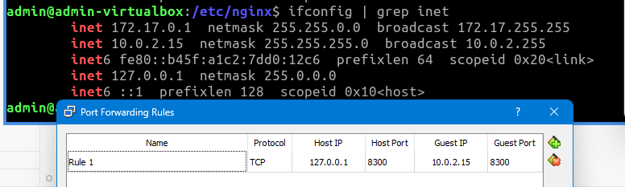
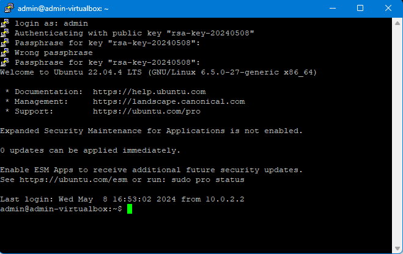

## Оперативни систем

Коришћен је **Lubuntu 24.04 LTS (Noble Numbat)**.
TODO: Лозинка на `starcraftrules`

## а. Покренути пројекат

`web-kangaroo` је фиктивна веб апликација написана за потребе овог задатка.
API сервер је писан у `Python 3.10` користећи `WebAPI` библиотеку. Серверу се
приступа преко `nginx`-a. Сервер комуницира са `MariaDB 11.3.2` базом података
користећи `SqlAlchemy` библиотеку.

## б. Комуникација преко мреже

Гост у VirtualBox инстанци користи NAT. Потребно је отворити порт:



```
HOST                     GUEST
127.0.0.1:8300   ---->   10.0.2.15:8300
```

## ц. SSH

Треба инсталирати пакет `openssh-server`.

```bash
sudo apt-get install openssh-server
```

Следеће две команде редом започињу и заустављају SSH сервер:

```bash
sudo systemctl start sshd
sudo systemctl stop sshd
```

Уместо `start` и `stop` се може користити `enable` и `disable` како би се
покренуло чим се покрене и OS.

Да би се споља могло комуницирати са SSH сервером, треба отворити порт:

```bash
sudo ufw allow ssh
```

Пре подешавања кључа, SSH конекција се може проверити на следећи начин:

1. Пошто Linux трчи на виртуелној машини у приватној мрежи, треба отворити порт:

```
HOST                     GUEST
127.0.0.1:2222   ---->   10.0.2.15:22
```

2. Windows нативно не подржава SSH, али се може користити [Putty](https://www.putty.org/).
3. SSH Конекција се успоставља на `127.0.0.1:2222`


Пошто се овде користи Putty, кључ се генерише користећи _PuttyGen_ (иначе би се користио ssh-keygen). Passphrase би требало да буде јак, овде је коришћен `bluesky123`. Приватни кључ остаје на host рачунару (тј. клијенту) а јавни кључ треба пребацити ка guest рачунару (тј. серверу). Конкретно, јавни кључ треба да се прекопира на `~/.ssh/authorized_keys`. Потенцијално се мењају и [пермисије](https://stackoverflow.com/a/49176668). Потом се на Putty алату можемо повезати ка серверу проследивши приватни кључ и passphrase.



## д. Secure Deployment Review

### д.1 System review

#### д.1.1 Operating System

```shell
admin@admin-virtualbox:~$ lsb_release -a
No LSB modules are available.
Distributor ID: Ubuntu
Description:    Ubuntu 22.04.4 LTS
Release:        22.04
Codename:       jammy
```

`Ubuntu 22.04.4 LTS` је подржан до јуна 2027. године, [извор](https://wiki.ubuntu.com/Releases).

```shell
admin@admin-virtualbox:~$ uname -a
Linux admin-virtualbox 6.5.0-27-generic #28~22.04.1-Ubuntu SMP PREEMPT_DYNAMIC Fri Mar 15 10:51:06 UTC 2 x86_64 x86_64 x86_64 GNU/Linux
```

Листа свих рањивости (укључујући и оних који нису нужно апликабилни) за ову верзију кернела, односно одговарајуће верзије дистрибуције, налази се [овде](https://ubuntu.com/security/cves?q=&package=&priority=critical&version=jammy&status=). Једина critical рањивост (backdoor у xz) није никада отишла у продукцију, а многе рањивости ниже опасности су митиговане.

TODO: Мало прецизније...

```shell
admin@admin-virtualbox:~$ uptime
 17:18:29 up  1:04,  6 users,  load average: 0.87, 1.06, 1.06
```

#### д.1.2 Time management

```shell
admin@admin-virtualbox:~$ cat /etc/timezone
Europe/Belgrade
```

Временска зона користи рачунање времена са померањем часовника тако да може доћи до проблема са синхронизацијом логова.

NTP није подешен:

```shell
admin@admin-virtualbox:~$ ps -edf | grep ntp
admin       1995    1847  0 18:20 ?        00:00:00 /snap/firefox/3779/usr/lib/firefox/firefox -contentproc -parentBuildID 20240206002040 -prefsLen 29341 -prefMapSize 235787 -appDir /snap/firefox/3779/usr/lib/firefox/browser {5a0d1359-463b-4c88-b3de-18776a4b1b13} 1847 true socket
admin       2029    1847  1 18:20 ?        00:01:20 /snap/firefox/3779/usr/lib/firefox/firefox -contentproc -childID 1 -isForBrowser -prefsLen 29482 -prefMapSize 235787 -jsInitLen 235124 -parentBuildID 20240206002040 -greomni /snap/firefox/3779/usr/lib/firefox/omni.ja -appomni /snap/firefox/3779/usr/lib/firefox/browser/omni.ja -appDir /snap/firefox/3779/usr/lib/firefox/browser {28f3481e-efcd-4ae1-8584-4b9009af37eb} 1847 true tab
admin       2169    1847  0 18:20 ?        00:00:26 /snap/firefox/3779/usr/lib/firefox/firefox -contentproc -childID 2 -isForBrowser -prefsLen 34983 -prefMapSize 235787 -jsInitLen 235124 -parentBuildID 20240206002040 -greomni /snap/firefox/3779/usr/lib/firefox/omni.ja -appomni /snap/firefox/3779/usr/lib/firefox/browser/omni.ja -appDir /snap/firefox/3779/usr/lib/firefox/browser {be8d8f49-3d7a-4fdd-be2f-96dc63097581} 1847 true tab
...
```

Мора се инсталирати (`sudo apt install ntp`) и онда:

```shell
admin@admin-virtualbox:~$ ps -edf | grep ntp
ntp         4410       1  0 19:47 ?        00:00:00 /usr/sbin/ntpd -p /var/run/ntpd.pid -g -u 125:133
admin       4561    4551  0 19:49 pts/1    00:00:00 grep --color=auto ntp


admin@admin-virtualbox:~$ ntpq -p -n
     remote           refid      st t when poll reach   delay   offset  jitter
==============================================================================
 0.ubuntu.pool.n .POOL.          16 p    -   64    0    0.000   +0.000   0.000
 1.ubuntu.pool.n .POOL.          16 p    -   64    0    0.000   +0.000   0.000
 2.ubuntu.pool.n .POOL.          16 p    -   64    0    0.000   +0.000   0.000
 3.ubuntu.pool.n .POOL.          16 p    -   64    0    0.000   +0.000   0.000
 ntp.ubuntu.com  .POOL.          16 p    -   64    0    0.000   +0.000   0.000
+44.190.40.123   66.220.9.122     2 u   17   64    3  170.448   +2.644  14.312
-195.178.51.145  131.188.3.221    2 u   19   64    3    5.668   -1.540  13.307
-216.177.181.129 129.7.1.66       2 u   17   64    3  155.225   +1.447  15.168
*195.178.58.245  192.168.106.2    2 u   19   64    3    3.692   -1.067  12.947
-45.79.214.107   130.207.244.240  2 u   17   64    3  130.568   +0.851  15.423
-155.248.196.28  128.138.140.44   2 u   18   64    3  190.361   -6.092  11.099
-147.91.8.1      91.187.128.199   2 u   16   64    3   49.757   -5.737  13.283
-171.66.97.126   171.64.7.105     2 u   16   64    3  169.593   -0.622  11.546
#44.31.46.123    216.218.192.202  3 u   16   64    3  168.950   +1.166   7.774
+217.24.20.5     84.16.73.33      2 u   15   64    3   10.866   -3.156   9.715
 185.125.190.56  201.68.88.106    2 u   16   64    3   44.274   -3.460  18.155
-74.208.117.38   216.239.35.4     2 u   17   64    3  152.124   -1.526  14.869
 91.189.91.157   132.163.96.1     2 u   17   64    3  102.488   -0.528  15.191
#64.142.54.12    206.55.64.77     3 u   14   64    3  185.448   +1.467  10.726
 185.125.190.57  183.160.133.132  2 u   16   64    3   34.788   -1.222  17.977
 185.125.190.58  79.243.60.50     2 u   13   64    3   44.257   -5.738  13.357

```

#### д.1.3 Packages installed

Иако `Lubuntu` има мање пакета преинсталираних од обичне `Ubuntu` инсталације, ручно скенирање `dpkg -l | less` би трајало предуго.

`sudo apt autoremove` није обрисао ништа.

За скенирање пакета за рањивости коришћен је `lynis`. Након покретања `sudo lynis audit system`, у report фајлу је пронађено следеће:

```bash
vulnerable_package[]=cpio
vulnerable_package[]=distro-info-data
vulnerable_package[]=less
vulnerable_package[]=libc-bin
vulnerable_package[]=libc6
vulnerable_package[]=libnghttp2-14
vulnerable_package[]=locales
vulnerable_package[]=python3-pil
```

Потребно је ажурирати пакете на новију верзију.

#### д.1.4 Logging

```bash
admin@admin-virtualbox:~$ ps -edf | grep syslog
message+     414       1  0 17:45 ?        00:00:01 @dbus-daemon --system --address=systemd: --nofork --nopidfile --systemd-activation --syslog-only
syslog       426       1  0 17:45 ?        00:00:00 /usr/sbin/rsyslogd -n -iNONE
admin        943     912  0 17:45 ?        00:00:00 /usr/bin/dbus-daemon --session --address=systemd: --nofork --nopidfile --systemd-activation --syslog-only
admin      55498    4551  0 20:17 pts/1    00:00:00 grep --color=auto syslog
```

Користи се `rsyslogd`. Садржај конфигурације:

```conf
# /etc/rsyslog.conf configuration file for rsyslog
#
# For more information install rsyslog-doc and see
# /usr/share/doc/rsyslog-doc/html/configuration/index.html
#
# Default logging rules can be found in /etc/rsyslog.d/50-default.conf


#################
#### MODULES ####
#################

module(load="imuxsock") # provides support for local system logging
#module(load="immark")  # provides --MARK-- message capability

# provides UDP syslog reception
#module(load="imudp")
#input(type="imudp" port="514")

# provides TCP syslog reception
#module(load="imtcp")
#input(type="imtcp" port="514")

...
```

Видимо да је логовање искључено. Исто је јавио и `lynis`:

```bash
remote_syslog_configured=0
suggestion[]=LOGG-2154|Enable logging to an external logging host for archiving purposes and additional protection|-|-|
```

### д.2

#### д.2.1

``

## е. Извлачење хеш лозинке
