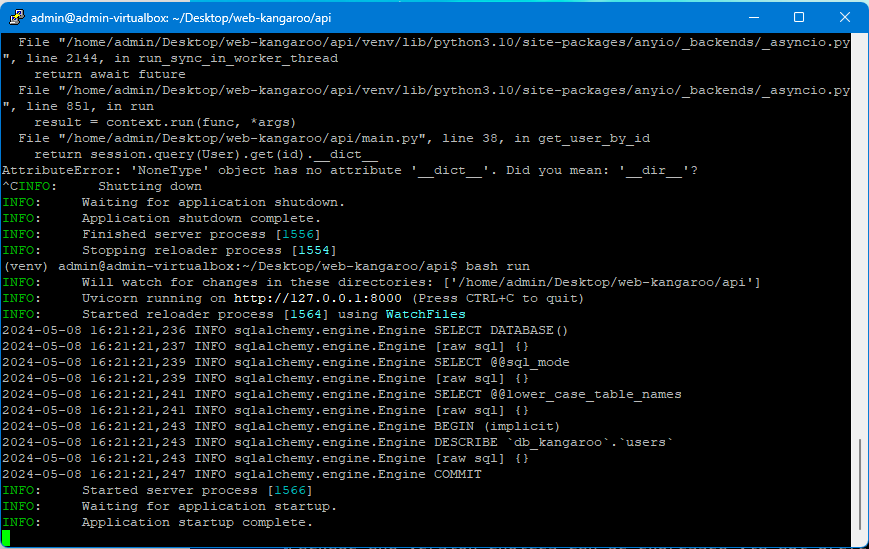

## Оперативни систем

Коришћен је **Lubuntu 24.04 LTS (Noble Numbat)**.
TODO: Лозинка на `starcraftrules`

## а. Покренути пројекат

`web-kangaroo`је фиктивна веб апликација написана за потребе овог задатка.
API сервер је писан у `Python 3.10` користећи `WebAPI` библиотеку. Серверу се
приступа преко `nginx`-a. Сервер комуницира са `MariaDB 11.3.2` базом података
користећи `SqlAlchemy` библиотеку.

## б. Комуникација преко мреже

Гост у VirtualBox инстанци користи NAT. Потребно је отворити порт:


```
HOST                     GUEST
127.0.0.1:8300   ---->   10.0.2.15:8300
```

## ц. SSH

Треба инсталирати пакет `openssh-server`.

```bash
sudo apt-get install openssh-server
```

Следеће две команде редом започињу и заустављају SSH сервер:

```bash
sudo systemctl start sshd
sudo systemctl stop sshd
```

Уместо `start` и `stop` се може користити `enable` и `disable` како би се
покренуло чим се покрене и OS.

Да би се споља могло комуницирати са SSH сервером, треба отворити порт:

```bash
sudo ufw allow ssh
```

Пре подешавања кључа, SSH конекција се може проверити на следећи начин:

1. Пошто Linux трчи на виртуелној машини у приватној мрежи, треба отворити порт:

```
HOST                     GUEST
127.0.0.1:2222   ---->   10.0.2.15:22
```

2. Windows нативно не подржава SSH, али се може користити [Putty](https://www.putty.org/).
3. SSH Конекција се успоставља на `127.0.0.1:2222`



Пошто се овде користи Putty, кључ се генерише користећи _PuttyGen_ (иначе би се користио ssh-keygen). Passphrase би требало да буде јак, овде је коришћен `bluesky123`. Приватни кључ остаје на host рачунару (тј. клијенту) а јавни кључ треба пребацити ка guest рачунару (тј. серверу). Конкретно, јавни кључ треба да се прекопира на `~/.ssh/authorized_keys`. Потенцијално се мењају и [пермисије](https://stackoverflow.com/a/49176668). Потом се на Putty алату можемо повезати ка серверу проследивши приватни кључ и passphrase.


## д. Secure Deployment Review

## е. Извлачење хеш лозинке
