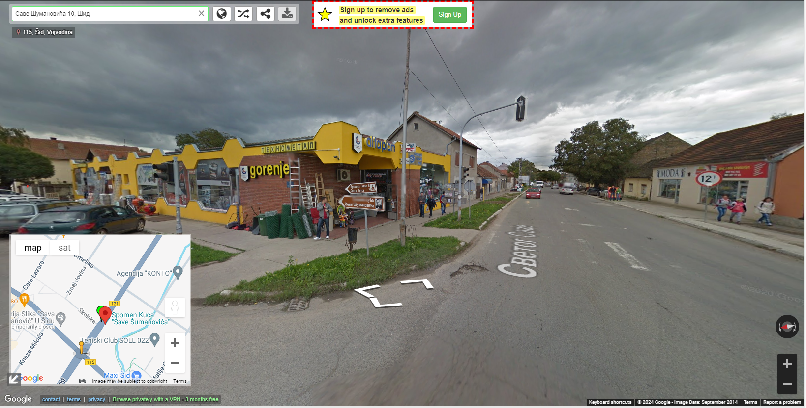
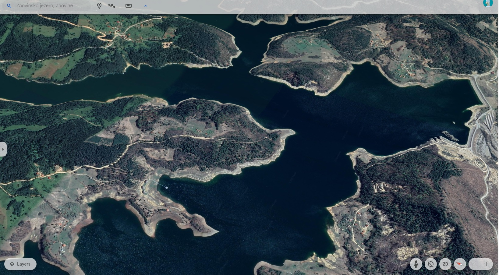
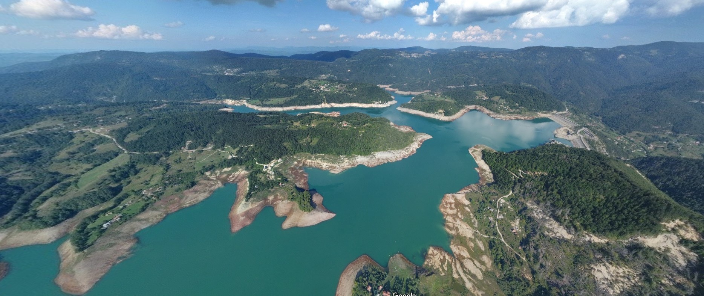

# 6. Pixel Perfect

Најмање значајан бит у RGB-u има тајну поруку.
Видети `steganography.ipynb` за детаље. Flag је:

```
UNS{PMF_5TUD3NT5_LOV3_M4TH}
```

# 7. Queen of the Ocean

Прво сам тражио "Queen of the Ocean" на интернету али се све односило на
бродове. Онда сам укуцао текст из задатка "In 2020 the Queen of the Ocean was
captured and tagged.". Наишао сам на артикле о великој белој ајкули Нукуми којој
су 2. октобра 2020. ставили справицу да прате где се налази. Детаљи су на [овом](https://www.ocearch.org/tracker/detail/nukumi) сајту. Последњи пинг је `Apr 11, 2021, 3:03:07 PM`, мада
спомиње се и `z-ping`, који је последњи ухваћен у октобру 2021. године.
Тако да је flag једно од ова два:

```
RC15{Apr 11, 2021, 3:03:07 PM}
RC15{Oct 11, 2021, 4:47:09 AM}
```

# 8. Squid Game Invitation

Пробао сам дешифровати слику као у 6. задатку:
- свих 8 слојева битова
- посебно посматрано RGB
- сума, разлика и XOR одређених слојева и канала

Али нема ништа. Онда сам пробао тражити ствари везане за мејл, али није ништа
искакало. Потом сам унео имејл адресу (са и без домена) на различитим сајтовима:
- Youtube
- Facebook
- Reddit
- Github

И на крају github је имао један налог, на којем је био репозиторијум, у којем
се налази фајл, где пише flag:

```
RC15{h4v3_y0u_3v3r_w4tched_!t?}
```

# 9. Maps OSINT 1

Пише на слици "Спомен кућа Саве Шумановића". То сам унео у Google-у и пише да је
у Шиду, улица Саве Шумановића 10. Отишао сам у Street View и нашао улицу:



У URL-у пишу географска ширина и дужина, па је flag:

```
UNS{45.126384,19.229227}
```

# 10. Maps OSINT 2

Унео сам слику у Google Image Search и он каже да је ово слика Заовинског језера.




Личи као да је то то. Онда би flag био:

```
UNS{43.8760256,19.39583721}
```

осим ако се не тражи нешто специфичније на слици.њ