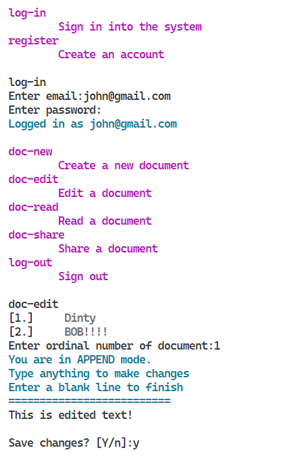

# Demo client 2

A minimal CLI-based document system.



## Getting started

You need to have Lesotho and Consul running.

Boot up the server:

### Obtain an API key

Development stage:

1. `cd api_key_requester`
2. `python api_key_requester.py`
3. When asked for client name, enter the one you set up as `api_key_client_name` in `config.ini`
4. Copy the API key in a `apikey.secret` file

Production stage:

**Not implemented**

### Run the server

```bash
pip install -r requirements.txt
run.bat
```

Open a client:

```bash
run.bat
```

## Using the client

Guests can login and register.

Logged in users can create new documents, edit documents (append only) and read
contents of documents.

To edit documents, you need the `editor` role, which is given to the `owner` of
the document, as well as any user with explicit editorial access (granted by the
`owner`).

To read documents, you need the `viewer` role, which `owners` and `editors`
implicitly have. The document `owner` may grant this role to other users, as well.