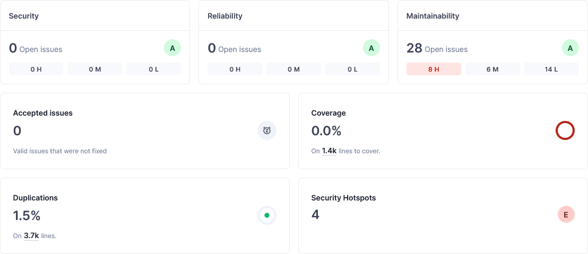
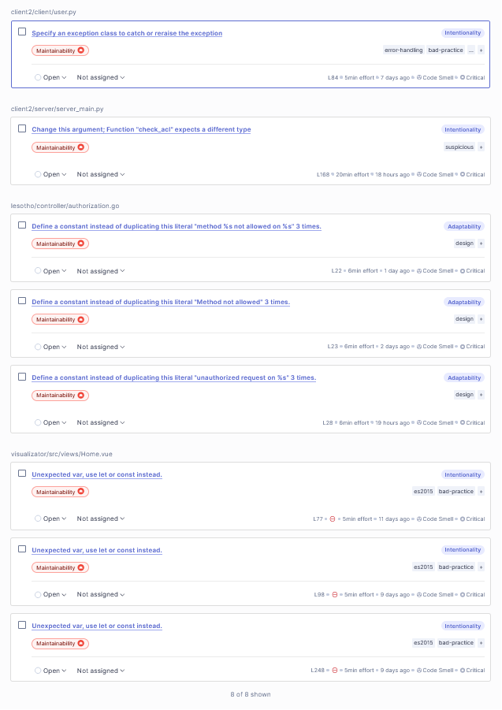
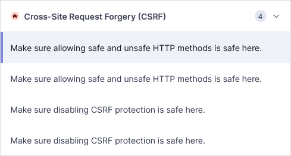

## GoSec

```
go install github.com/securego/gosec/v2/cmd/gosec@latest
```

```
cd lesotho/lesotho
gosec -r
```

Output:

```
[\main.go:125] - G114 (CWE-676): Use of net/http serve function that has no support for setting timeouts (Confidence: HIGH, Severity: MEDIUM)
    124:
  > 125:        http.ListenAndServe("127.0.0.1:5000", nil)
    126: }


[\namespace\store.go:72] - G304 (CWE-22): Potential file inclusion via variable (Confidence: HIGH, Severity: MEDIUM)
    71: func (nss *NamespaceStore) AddFromFile(namespaceName string, namespaceDataFname string) {
  > 72:         data, err := os.ReadFile(namespaceDataFname)
    73:         if err != nil {


[\acl\acl.go:86] - G304 (CWE-22): Potential file inclusion via variable (Confidence: HIGH, Severity: MEDIUM)
    85: func (acl *ACL) AddFromFile(aclDataFname string, nss *ns.NamespaceStore) {
  > 86:         file, err := os.Open(aclDataFname)
    87:         if err != nil {


[\main.go:125] - G104 (CWE-703): Errors unhandled. (Confidence: HIGH, Severity: LOW)
    124:
  > 125:        http.ListenAndServe("127.0.0.1:5000", nil)
    126: }


[\main.go:77] - G104 (CWE-703): Errors unhandled. (Confidence: HIGH, Severity: LOW)
    76:         w.Header().Set("Content-Type", "application/json")
  > 77:         json.NewEncoder(w).Encode(result)
    78: }


[\acl\acl.go:33] - G104 (CWE-703): Errors unhandled. (Confidence: HIGH, Severity: LOW)
    32:         if acl.db != nil {
  > 33:                 acl.db.Close()
    34:         }


Summary:
  Gosec  : dev
  Files  : 7
  Lines  : 632
  Nosec  : 0
  Issues : 6
```

Закључак:
- `http.ListenAndServe` нема подршку за Timeout, што омогућава извршити DoS напад коритећи нпр. `slowloris`.
    - **Решење**: Направити `http.Server`, поставити му `ReadHeaderTimeout` и користити `srvr.ListenAndServe()`.
- `AddFromFile` за NSS и ACL чита фајл на основу задатог имена. Без рестрикције, ово је подложно нападима. 
    - **Решење**: Користити `filepath.Clean(fname)`.
- На пар места је игнорисана `error` повратна вредност функција, што временом може изазвати велик технички дуг.
    - **Решење**: Обрадити случај када одговарајуће функције врате грешку.

## Bandit

```
pip install bandit
```

```
cd lesotho/api`
bandit . -r
```

Output:
```
Test results:
>> Issue: [B113:request_without_timeout] Requests call without timeout
   Severity: Medium   Confidence: Low
   CWE: CWE-400 (https://cwe.mitre.org/data/definitions/400.html)
   More Info: https://bandit.readthedocs.io/en/1.7.9/plugins/b113_request_without_timeout.html
   Location: .\main.py:25:10
24
25          acl = requests.post(f'{LESOTHO_URL}/acl', json=request.get_json())
26          if (acl.status_code == 400):

--------------------------------------------------
>> Issue: [B113:request_without_timeout] Requests call without timeout
   Severity: Medium   Confidence: Low
   CWE: CWE-400 (https://cwe.mitre.org/data/definitions/400.html)
   More Info: https://bandit.readthedocs.io/en/1.7.9/plugins/b113_request_without_timeout.html
   Location: .\main.py:37:12
36
37          check = requests.get(f'{LESOTHO_URL}/acl/check', {
38              'object': request.args.get("object"),
39              'relation': request.args.get("relation"),
40              'user': request.args.get("user"),
41          })
42          if (check.status_code == 400):

--------------------------------------------------
>> Issue: [B113:request_without_timeout] Requests call without timeout
   Severity: Medium   Confidence: Low
   CWE: CWE-400 (https://cwe.mitre.org/data/definitions/400.html)
   More Info: https://bandit.readthedocs.io/en/1.7.9/plugins/b113_request_without_timeout.html
   Location: .\main.py:58:16
57
58          namespace = requests.post(f'{LESOTHO_URL}/namespace', json=request.get_json())
59          if (namespace.status_code == 400):

--------------------------------------------------

Code scanned:
        Total lines of code: 48
        Total lines skipped (#nosec): 0

Run metrics:
        Total issues (by severity):
                Undefined: 0
                Low: 0
                Medium: 3
                High: 0
        Total issues (by confidence):
                Undefined: 0
                Low: 3
                Medium: 0
                High: 0
Files skipped (0):
```

```
cd lesotho/client2/server
bandit . -r
```

```
Test results:
>> Issue: [B113:request_without_timeout] Requests call without timeout
   Severity: Medium   Confidence: Low
   CWE: CWE-400 (https://cwe.mitre.org/data/definitions/400.html)
   More Info: https://bandit.readthedocs.io/en/1.7.9/plugins/b113_request_without_timeout.html
   Location: .\service.py:15:20
14
15              namespace = requests.post(f'{LESOTHO_URL}/namespace', json=b)
16              if (namespace.status_code == 400):

--------------------------------------------------
>> Issue: [B113:request_without_timeout] Requests call without timeout
   Severity: Medium   Confidence: Low
   CWE: CWE-400 (https://cwe.mitre.org/data/definitions/400.html)
   More Info: https://bandit.readthedocs.io/en/1.7.9/plugins/b113_request_without_timeout.html
   Location: .\service.py:29:10
28
29          acl = requests.post(f'{LESOTHO_URL}/acl', json=b)
30          if (acl.status_code == 400):

--------------------------------------------------
>> Issue: [B113:request_without_timeout] Requests call without timeout
   Severity: Medium   Confidence: Low
   CWE: CWE-400 (https://cwe.mitre.org/data/definitions/400.html)
   More Info: https://bandit.readthedocs.io/en/1.7.9/plugins/b113_request_without_timeout.html
   Location: .\service.py:42:12
41
42          check = requests.get(f'{LESOTHO_URL}/acl/check', params=b)
43          if check.status_code > 200:

--------------------------------------------------

Code scanned:
        Total lines of code: 202
        Total lines skipped (#nosec): 0

Run metrics:
        Total issues (by severity):
                Undefined: 0
                Low: 0
                Medium: 3
                High: 0
        Total issues (by confidence):
                Undefined: 0
                Low: 3
                Medium: 0
                High: 0
Files skipped (0):
```

Закључак:
- Када шаљемо HTTP захтеве, потребно је специфицирати `timeout`  да програм не би висио
    - **Решење**: Додати `timetout` параметар

## Knip

```
cd visualizator
npm init @knip/config
npm run knip

> visualizator@0.0.0 knip
> knip

✂️  Excellent, Knip found no issues.
```

```
cd frontend
npm init @knip/config
npm run knip

> frontend@0.0.0 knip
> knip

Analyzing workspace ....
Unused exports (15)
buttonVariants            unknown  src/components/ui/button.tsx:56:17
DropdownMenuCheckboxItem  unknown  src/components/ui/dropdown-menu.tsx:186:20
DropdownMenuRadioItem     unknown  src/components/ui/dropdown-menu.tsx:187:28
DropdownMenuLabel         unknown  src/components/ui/dropdown-menu.tsx:188:25
DropdownMenuSeparator     unknown  src/components/ui/dropdown-menu.tsx:189:21
DropdownMenuShortcut      unknown  src/components/ui/dropdown-menu.tsx:190:25
DropdownMenuGroup         unknown  src/components/ui/dropdown-menu.tsx:191:24
DropdownMenuPortal        unknown  src/components/ui/dropdown-menu.tsx:192:21
DropdownMenuSub           unknown  src/components/ui/dropdown-menu.tsx:193:22
DropdownMenuSubContent    unknown  src/components/ui/dropdown-menu.tsx:194:19
DropdownMenuSubTrigger    unknown  src/components/ui/dropdown-menu.tsx:195:26
DropdownMenuRadioGroup    unknown  src/components/ui/dropdown-menu.tsx:196:26
ToastAction               unknown  src/components/ui/toast.tsx:125:14
toast                     unknown  src/components/ui/use-toast.ts:192:19
reducer                   unknown  src/components/ui/use-toast.ts:75:14
Unused exported types (4)
ButtonProps            interface  src/components/ui/button.tsx:36:18
InputProps             interface  src/components/ui/input.tsx:5:18
ACLDirective           interface  src/http/endpoints.ts:3:18
AuthorizationResponse  interface  src/http/endpoints.ts:9:18
```

Закључак:
- фронт апликација има некоришћене експорте. Ово није безбедносни пропуст.

## OWASP Dependency Checker

```
dependency-check.bat -s .\lesotho\frontend
dependency-check.bat -s .\lesotho\visualizator
```

У оба случаја, једину рањивост има **micromatch:4.0.7**, `CVE-2024-4067`.

## SonarQube

Инструкције за покретање погледати [ovde](https://docs.sonarsource.com/sonarqube/10.5/try-out-sonarqube/) i [ovde](https://docs.sonarsource.com/sonarqube/10.5/analyzing-source-code/scanners/sonarscanner/).



_Coverage_ је 0% зато што је за његово рачунање потребан одвојен алат повезан на _SonarQube_.

### _Maintanability_
_Maintanability_ проблеми се претежно тичу преименовања променљивих, употребе константи где је могуће, уклањања некоришћених промењивих... на слици су приказани проблеми највећег приоритета.



### _Security Hotspots_



#### Make sure allowing safe and unsafe HTTP methods is safe here

Односи се на следећу линију кода:
```python
@app.route("/something", methods=["POST", "OPTIONS"])
def handle():
...
```

Пошто је _OPTIONS_ "безбедна", а _POST_ "небезбедна" метода, проблем је што коришћени декоратор примењује обе методе на исту хендлер функцију. Решење би било имати одвојене хендлер функције за ове две методе.

```python
@app.route("/something", methods=["POST"])
def handle1():
...

@app.route("/something", methods=["OPTIONS"])
def handle2():
...
```

#### Make sure disabling CSRF protection is safe here

Приликом инстанцирања _Flask_ сервера требало би укључити _CSRF_ заштиту:

```python
app = Flask(__name__)
csrf = CSRFProtect()
csrf.init_app(app)
```